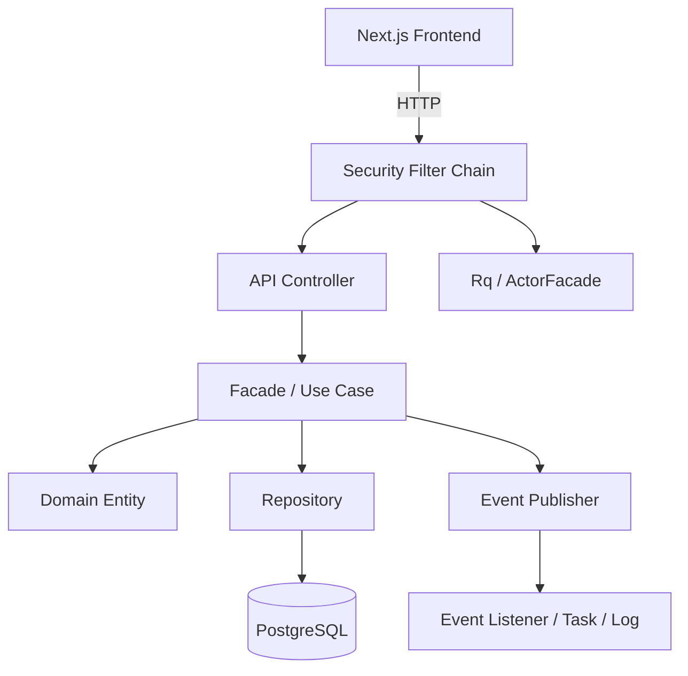
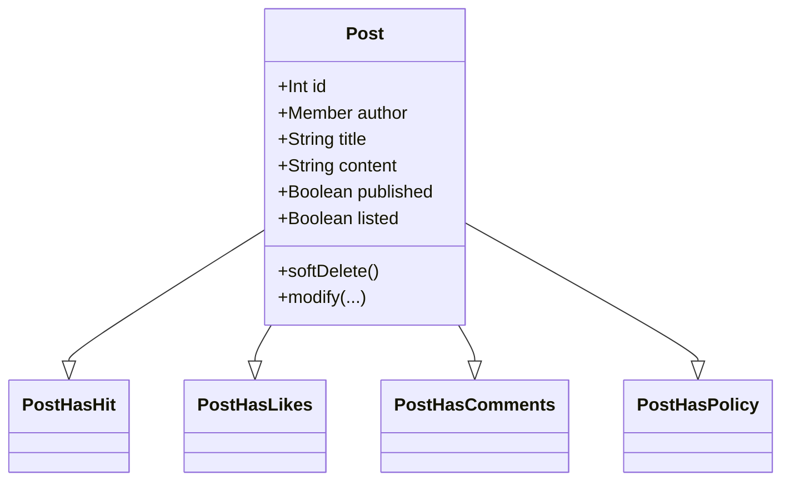
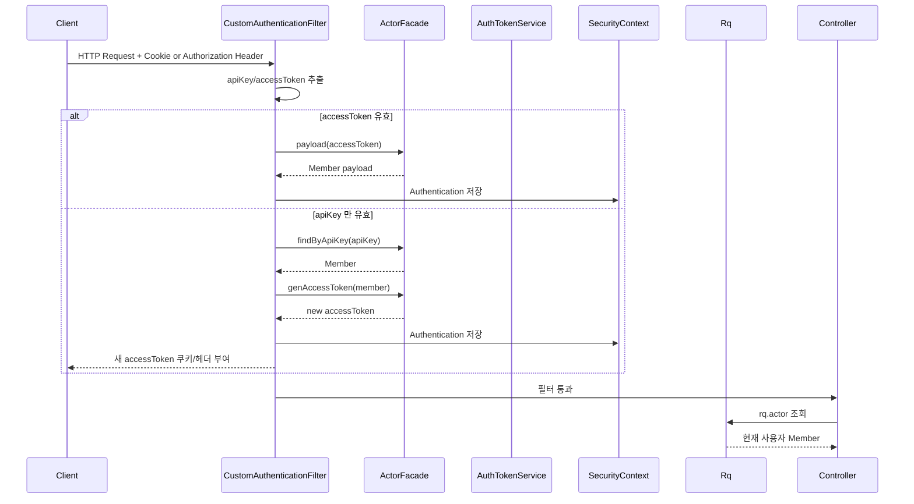
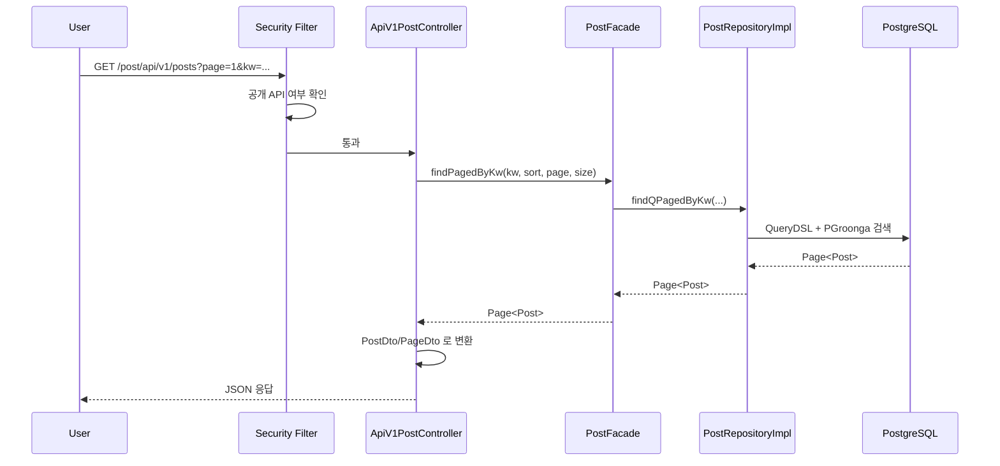
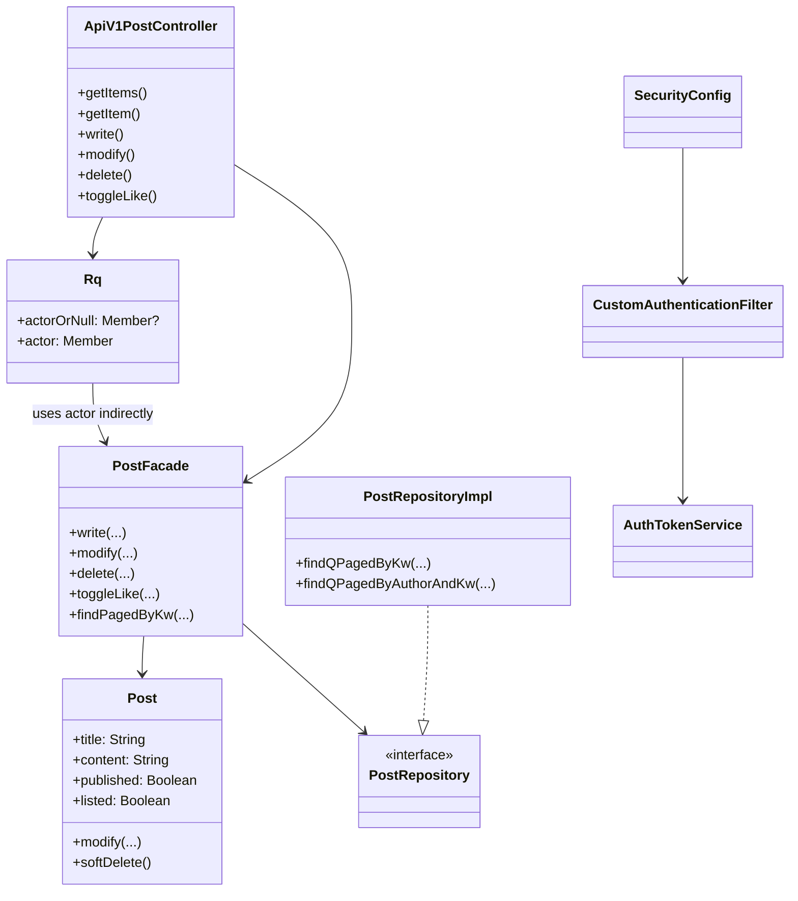

# 프로젝트 이해 강의 노트

이 문서는 이 저장소를 빠르게 이해하기 위한 강의형 README 초안이다.
설명은 실제 코드 기준으로 진행한다.

대상 독자:

- Kotlin + Spring + JPA 기본 문법을 아는 사람
- REST API, JWT, OAuth2 개념은 이미 이해한 사람
- 이 프로젝트가 "어떻게 나뉘어 있고 어디서 무엇을 처리하는지"를 빠르게 파악하고 싶은 사람

백엔드 우선 원칙:

- 설명의 중심은 당분간 `back/` 이다.
- `front/` 는 인증 계약이나 API 소비 지점 정도만 보조적으로 언급한다.
- 프론트 상세 해설은 백엔드 강의가 충분히 진행된 뒤로 미룬다.

---

## 강의 시리즈 구성 초안

이 프로젝트는 길게 보면 100강 이상으로도 풀 수 있다. 진행은 백엔드부터 끝까지 간 다음 프론트로 넘어가는 순서로 잡는다.

1. 프로젝트 전체 지도 읽기
2. 백엔드 엔트리포인트와 Spring Boot 부팅
3. Gradle 의존성으로 아키텍처 읽기
4. 패키지 구조와 bounded context
5. global 레이어는 무엇을 담당하는가
6. member 컨텍스트 전체 구조
7. post 컨텍스트 전체 구조
8. Facade 패턴을 왜 썼는가
9. Controller 는 어디까지 얇아야 하는가
10. RequestScope `Rq` 의 역할
11. `RsData` 응답 포맷
12. 예외 처리 전략
13. 인증의 전체 흐름
14. `CustomAuthenticationFilter` 해부
15. `SecurityConfig` 해부
16. API 공개/비공개 정책 설계
17. JWT 발급과 검증
18. API Key 와 Access Token 을 같이 쓰는 이유
19. OAuth2 로그인 흐름
20. OAuth2 성공 후 내부 회원 동기화
21. `ActorFacade` 와 현재 사용자 조회
22. `SecurityUser` 설계
23. Member 엔티티 읽기
24. Member 정책과 권한
25. Member Attribute 패턴
26. Post 엔티티 읽기
27. Post 의 mixin 스타일 도메인 분리
28. 게시글 좋아요 구조
29. 게시글 댓글 구조
30. 게시글 조회수 구조
31. Soft Delete 전략
32. `@SQLRestriction` 의 의미
33. `BaseEntity` 와 `Persistable`
34. `BaseTime` 과 JPA Auditing
35. 리치 도메인 vs 서비스형 도메인
36. Post 작성 유스케이스
37. Post 수정 유스케이스
38. Post 삭제 유스케이스
39. 댓글 작성/수정/삭제 유스케이스
40. 좋아요 토글 유스케이스
41. 임시글 생성 유스케이스
42. QueryDSL 검색 구조
43. PGroonga 전문 검색
44. Pageable + 정렬 전략
45. RepositoryCustom 패턴
46. AfterDDL 인덱스 전략
47. 이벤트 발행 구조
48. 게시글 이벤트 종류 정리
49. 회원 액션 로그 서브컨텍스트
50. Task 시스템 개요
51. 스케줄러와 비동기 처리 가능성
52. Redis 의 역할
53. Session 을 안 쓰면서 Session 관련 의존성이 있는 이유
54. CORS 설정 읽기
55. application.yaml 읽는 법
56. dev/test profile 차이
57. schema.sql 초기화 전략
58. 테스트 코드로 요구사항 읽기
59. Member API 테스트 읽기
60. Post API 테스트 읽기
61. 댓글 API 테스트 읽기
62. 통합 테스트와 슬라이스 테스트의 경계
63. DTO 레이어 읽기
64. Entity 를 직접 안 내보내는 이유
65. 도메인 정책 메서드 해부
66. `checkActorCanRead` 류 메서드의 의미
67. 공개글과 비공개글 모델링
68. listed/published 분리 의도
69. author 와 actor 의 차이
70. count attr 패턴의 장단점
71. 검색 성능을 위한 인덱스 설계
72. QueryDSL 유틸 설계
73. 커스텀 dialect 사용 이유
74. 개발용 데이터 초기화 전략
75. 운영에서 주의할 보안 포인트
76. 리팩터링 후보 찾기
77. 문맥상 어색한 네이밍 찾기
78. 인증 필터 공개 경로 점검
79. 테스트 보강 포인트 찾기
80. 도메인 이벤트 확장 포인트
81. README 를 아키텍처 문서로 발전시키기
82. 신규 기능 추가 연습: 북마크
83. 신규 기능 추가 연습: 태그
84. 신규 기능 추가 연습: 알림
85. 관리자 감사 로그
86. 검색 고도화
87. 소프트 삭제 데이터 관리
88. 캐시 전략 개선
89. CQRS 로 갈 수 있는 지점
90. 멀티 모듈로 분리할 수 있는 지점
91. DDD 관점에서 잘한 점
92. DDD 관점에서 어색한 점
93. 운영 관측성 추가하기
94. API 문서 자동화
95. 배포 구조 정리
96. 비동기 이벤트 재시도 전략
97. 테스트 데이터 전략
98. 성능 병목 추적
99. 보안 점검 체크리스트
100. 이 프로젝트를 포트폴리오로 설명하는 법
101. 면접에서 이 아키텍처 설명하는 법
102. 이 구조로 팀 개발할 때의 규칙
103. 최종 정리: 이 프로젝트의 핵심 설계 철학
104. 프론트 구조 개요
105. Next.js app router 구조
106. 프론트 API 클라이언트
107. OpenAPI 타입 연동
108. 인증 훅 구조
109. 게시글 페이지 구조
110. 게시글 상세 페이지 구조
111. 댓글 UI 와 API 연결
112. 에디터 컴포넌트 구조
113. 마크다운 렌더링 구조
114. 웹소켓/Stomp 구조
115. 새 글 알림 훅
116. 관리자 페이지 구조
117. 백엔드/프론트 URL 연결
118. 프론트에서 쿠키 인증 쓰는 이유
119. 프론트 상태 관리 전략
120. 백엔드-프론트 계약 안정화

---

# 1강. 이 프로젝트는 어떻게 읽어야 하는가

1강 목표는 간단하다.

- 폴더를 보고 겁먹지 않기
- 이 프로젝트를 "화면 목록"이 아니라 "문맥 단위"로 읽기
- HTTP 요청 1개가 어떤 층을 통과하는지 머릿속에 그리기
- 나중에 세부 구현을 읽을 때 길을 잃지 않도록 큰 지도를 먼저 만들기

---

## 1. 이 프로젝트를 한 문장으로 요약하면

이 프로젝트는:

> `front` 에는 Next.js 기반 클라이언트가 있고, `back` 에는 Kotlin + Spring Boot + JPA 기반 API 서버가 있으며, 백엔드는 `member`, `post`, `global` 문맥으로 나뉘고 JWT/OAuth2 인증과 QueryDSL 검색, 이벤트 기반 후처리를 결합한 구조다.

조금 더 실무적으로 말하면:

- 프론트는 API 서버를 `credentials: "include"` 로 호출한다.
- 백엔드는 stateless 보안 구성을 사용한다.
- 인증은 JWT access token + apiKey + OAuth2 로그인으로 조합되어 있다.
- 게시글과 회원 기능이 bounded context 수준으로 분리되어 있다.
- 컨트롤러는 얇고, `Facade` 가 유스케이스를 수행하며, 엔티티는 정책과 상태 변경 책임을 일부 가진다.

---

## 2. 최상위 폴더부터 읽자

루트 기준으로 가장 먼저 보이는 구조는 이렇다.

```text
p-14141-1/
├── back/
│   ├── build.gradle.kts
│   └── src/main/kotlin/com/back/
│       ├── boundedContexts/
│       │   ├── member/
│       │   └── post/
│       └── global/
└── front/
    ├── package.json
    └── src/
```

이 구조만 봐도 중요한 힌트가 나온다.

### 첫 번째 힌트: 프론트와 백이 분리되어 있다

- `front/` 는 Next.js 프론트엔드다.
- `back/` 는 Spring Boot API 서버다.

즉, 이 저장소는 단순 백엔드 예제가 아니라 프론트와 백이 함께 있는 풀스택 저장소다.

### 두 번째 힌트: 백엔드는 기능별로 잘려 있다

`back/src/main/kotlin/com/back/` 아래를 보면 크게 2종류가 있다.

- `boundedContexts/`
- `global/`

이건 매우 중요하다.

이 프로젝트는 클래스를 "기술 기준"으로만 묶지 않고 "업무 문맥 기준"으로 먼저 나누려는 의도가 있다.

즉:

- `member` 는 회원 문맥
- `post` 는 게시글 문맥
- `global` 은 여러 문맥이 공통으로 쓰는 기반 기능

이걸 먼저 이해해야 한다.

---

## 3. 의존성만 봐도 프로젝트 성격이 보인다

`back/build.gradle.kts` 에서 이 프로젝트의 성격이 거의 드러난다.

```kotlin
dependencies {
    implementation("org.springframework.boot:spring-boot-starter-data-jpa")
    implementation("org.springframework.boot:spring-boot-starter-data-redis")
    implementation("org.springframework.boot:spring-boot-starter-security")
    implementation("org.springframework.boot:spring-boot-starter-security-oauth2-client")
    implementation("org.springframework.boot:spring-boot-starter-session-data-redis")
    implementation("org.springframework.boot:spring-boot-starter-validation")
    implementation("org.springframework.boot:spring-boot-starter-webmvc")

    implementation("io.jsonwebtoken:jjwt-api:0.13.0")

    implementation("io.github.openfeign.querydsl:querydsl-jpa:7.1")
    implementation("io.github.openfeign.querydsl:querydsl-kotlin:7.1")

    implementation("org.springdoc:springdoc-openapi-starter-webmvc-ui:3.0.2")

    implementation("net.javacrumbs.shedlock:shedlock-spring:7.6.0")
    implementation("net.javacrumbs.shedlock:shedlock-provider-redis-spring:7.6.0")

    runtimeOnly("org.postgresql:postgresql")
}
```

여기서 읽어야 할 포인트는 다음이다.

- `data-jpa`: 엔티티 중심의 영속성 모델을 쓴다.
- `security` + `oauth2-client`: 직접 로그인 + 소셜 로그인 둘 다 있다.
- `jjwt`: JWT access token 을 직접 발급/검증한다.
- `querydsl`: 단순 메서드 이름 쿼리만 쓰는 프로젝트가 아니다.
- `redis`: 캐시, 분산락, 세션성 데이터, 작업 처리 보조 등 확장 여지가 있다.
- `springdoc`: OpenAPI 문서화가 가능하다.
- `postgresql`: 데이터베이스는 PostgreSQL 전제다.

즉 이 프로젝트는 입문용 장난감 수준이 아니라, 실제 서비스 구조를 학습하기 좋은 재료가 꽤 들어 있다.

---

## 4. 백엔드의 큰 지도

백엔드를 아주 거칠게 그리면 다음과 같다.



여기서 핵심은:

- 모든 요청이 곧장 Controller 로 가지 않는다.
- 먼저 보안 필터 체인을 통과한다.
- 컨트롤러는 주로 요청/응답 변환만 한다.
- 진짜 업무 흐름은 `Facade` 가 잡는다.
- 도메인 엔티티는 단순 데이터 통이 아니라 정책과 상태 변경 메서드를 가진다.
- 부수효과는 이벤트로 분리하려는 흔적이 있다.

---

## 5. 패키지 구조를 DDD 스타일로 읽어보자

예를 들어 `post` 컨텍스트만 잘라 보면 대략 이렇게 보인다.

```text
post/
├── app/
│   └── PostFacade.kt
├── config/
│   ├── PostAppConfig.kt
│   └── PostSecurityConfigurer.kt
├── domain/
│   ├── Post.kt
│   ├── PostComment.kt
│   ├── PostLike.kt
│   └── postMixin/
├── dto/
├── event/
├── in/
│   ├── ApiV1PostController.kt
│   ├── ApiV1PostCommentController.kt
│   └── ApiV1AdmPostController.kt
└── out/
    ├── PostRepository.kt
    ├── PostRepositoryImpl.kt
    └── ...
```

이 구조를 계층적으로 다시 번역하면:

- `in`: 외부에서 들어오는 요청을 받는 입구
- `app`: 유스케이스를 조합하는 응용 서비스
- `domain`: 핵심 비즈니스 상태와 규칙
- `out`: DB, 외부 시스템 등 바깥으로 나가는 출구
- `config`: 해당 문맥에만 필요한 설정
- `dto`: API 응답/이벤트 전송용 구조
- `event`: 상태 변화 이후 발생한 사건

즉, 이 프로젝트는 흔한 `controller/service/repository/entity` 4분법보다 조금 더 문맥 중심으로 정리되어 있다.

---

## 6. 첫 번째 핵심 관찰: Controller 는 얇다

`ApiV1PostController` 일부를 보자.

```kotlin
@RestController
@RequestMapping("/post/api/v1/posts")
class ApiV1PostController(
    private val postFacade: PostFacade,
    private val rq: Rq,
) {
    @PostMapping
    @ResponseStatus(HttpStatus.CREATED)
    @Transactional
    fun write(@Valid @RequestBody reqBody: PostWriteRequest): RsData<PostDto> {
        val post = postFacade.write(
            rq.actor,
            reqBody.title,
            reqBody.content,
            reqBody.published ?: false,
            reqBody.listed ?: false,
        )
        return RsData("201-1", "${post.id}번 글이 작성되었습니다.", PostDto(post))
    }
}
```

이 메서드에서 컨트롤러가 하는 일은 딱 이 정도다.

1. 요청 바디를 받는다.
2. 현재 로그인 사용자를 `rq.actor` 로 가져온다.
3. 실제 쓰기 작업은 `postFacade.write(...)` 에 위임한다.
4. 결과를 DTO 로 포장해 반환한다.

즉, 컨트롤러는 "입출력 어댑터"에 가깝다.

이 프로젝트를 읽을 때 컨트롤러에서 오래 머물면 안 된다.

실제 로직은 대부분 `Facade`, `Domain`, `RepositoryImpl` 에 있다.

---

## 7. 두 번째 핵심 관찰: Facade 가 유스케이스를 수행한다

이번에는 `PostFacade.write` 를 보자.

```kotlin
@Transactional
fun write(
    author: Member,
    title: String,
    content: String,
    published: Boolean = false,
    listed: Boolean = false,
): Post {
    val post = Post(0, author, title, content, published, listed)
    val savedPost = postRepository.save(post)
    author.incrementPostsCount()

    eventPublisher.publish(
        PostWrittenEvent(UUID.randomUUID(), PostDto(savedPost), MemberDto(author))
    )

    return savedPost
}
```

여기서 보이는 설계 포인트는 다음과 같다.

- 새 게시글 엔티티를 생성한다.
- 저장한다.
- 작성자 집계값을 갱신한다.
- 게시글 작성 이벤트를 발행한다.

이 메서드는 단순 CRUD 가 아니라 "게시글 작성"이라는 유스케이스를 묶어서 처리한다.

즉 `Facade` 는 그냥 서비스 계층이 아니라, 이 프로젝트에서는 유스케이스 오케스트레이터에 더 가깝다.

---

## 8. 세 번째 핵심 관찰: 엔티티도 생각보다 많은 책임을 가진다

`Post` 엔티티 일부를 보자.

```kotlin
class Post(
    override val id: Int = 0,
    val author: Member,
    var title: String,
    var content: String,
    var published: Boolean = false,
    var listed: Boolean = false,
) : BaseTime(id), PostHasHit, PostHasLikes, PostHasComments, PostHasPolicy {

    @field:Column
    var deletedAt: Instant? = null

    fun softDelete() {
        deletedAt = Instant.now()
    }

    fun modify(title: String, content: String, published: Boolean? = null, listed: Boolean? = null) {
        this.title = title
        this.content = content
        published?.let { this.published = it }
        listed?.let { this.listed = it }
        if (!this.published) this.listed = false
    }
}
```

눈여겨봐야 할 점:

- 엔티티가 `softDelete()` 를 스스로 수행한다.
- 엔티티가 `modify()` 규칙을 스스로 가진다.
- `published` 가 false 면 `listed` 를 강제로 false 로 만든다.

즉 중요한 비즈니스 규칙이 서비스 바깥이 아니라 엔티티 안에도 들어 있다.

이런 구조를 읽을 때는:

- "이 엔티티는 어떤 상태를 갖는가?"
- "상태 전이가 어디서 일어나는가?"
- "전이 규칙을 누가 보장하는가?"

이 세 질문을 계속 던지면 된다.

---

## 9. `post` 는 왜 mixin 으로 쪼개져 있을까

`Post` 는 `PostHasHit`, `PostHasLikes`, `PostHasComments`, `PostHasPolicy` 를 구현한다.

이건 단순 취향이 아니다.

게시글이라는 엔티티 하나 안에 책임이 많아지니까:

- 조회수 관련 로직
- 좋아요 관련 로직
- 댓글 관련 로직
- 권한 정책 관련 로직

을 파일로 분산해서 읽기 쉽게 만든 것이다.

개념적으로 그리면 이런 느낌이다.



실제로는 Kotlin interface + extension/mixin 스타일이지만, 읽는 관점에서는 "게시글 도메인의 책임 분할"로 보면 된다.

---

## 10. 인증 흐름은 이 프로젝트 이해의 핵심이다

이 프로젝트는 인증이 단순하지 않다.

### 핵심 등장인물

- `SecurityConfig`
- `CustomAuthenticationFilter`
- `AuthTokenService`
- `ActorFacade`
- `Rq`
- `ApiV1AuthController`

이들의 관계를 먼저 그림으로 보자.



이 그림이 중요한 이유는:

- 인증이 컨트롤러 안에서 되지 않는다.
- 인증이 필터에서 먼저 끝난다.
- 컨트롤러는 "이미 인증이 끝난 사용자"를 `rq.actor` 로 꺼내 쓰기만 한다.

---

## 11. `SecurityConfig` 는 전체 보안 정책의 메인 스위치다

`SecurityConfig` 의 핵심 부분을 보자.

```kotlin
http {
    authorizeHttpRequests {
        authSecurityConfigurer.configure(this)
        memberSecurityConfigurer.configure(this)
        postSecurityConfigurer.configure(this)

        authorize("/*/api/*/adm/**", hasRole("ADMIN"))
        authorize("/*/api/*/**", authenticated)
        authorize(anyRequest, permitAll)
    }

    csrf { disable() }
    formLogin { disable() }
    logout { disable() }
    httpBasic { disable() }

    sessionManagement {
        sessionCreationPolicy = SessionCreationPolicy.STATELESS
    }

    oauth2Login { ... }

    addFilterBefore<UsernamePasswordAuthenticationFilter>(customAuthenticationFilter)
}
```

이 코드 한 덩어리에서 읽어야 할 포인트:

### 1. 기본값은 보호다

- `/*/api/*/**` 는 인증 필요
- 단, 각 컨텍스트 configurer 가 공개 API 를 예외로 열어준다

즉 "일단 잠그고 필요한 것만 연다" 전략이다.

### 2. 세션 기반이 아니다

- `STATELESS`
- form login, logout, httpBasic 비활성화

즉 스프링 시큐리티 기본 로그인 페이지가 아니라, API 서버 중심 설계다.

### 3. 커스텀 인증 필터가 앞에 들어간다

이 프로젝트 인증의 실제 핵심은 스프링 기본 UsernamePassword 흐름이 아니라 `CustomAuthenticationFilter` 다.

---

## 12. `CustomAuthenticationFilter` 는 이 프로젝트 인증의 실무 핵심이다

이 필터의 알고리즘을 요약하면 다음과 같다.

```kotlin
private fun authenticateIfPossible(request: HttpServletRequest, response: HttpServletResponse) {
    val (apiKey, accessToken) = extractTokens(request)

    if (apiKey.isBlank() && accessToken.isBlank()) return

    if (apiKey == AppConfig.systemMemberApiKey && accessToken.isBlank()) {
        authenticate(MemberPolicy.SYSTEM)
        return
    }

    val payloadMember = accessToken
        .takeIf { it.isNotBlank() }
        ?.let(actorFacade::payload)
        ?.let { Member(it.id, it.username, null, it.name) }

    if (payloadMember != null) {
        authenticate(payloadMember)
        return
    }

    val member = actorFacade.findByApiKey(apiKey)
        ?: throw AppException("401-3", "API 키가 유효하지 않습니다.")

    val newAccessToken = actorFacade.genAccessToken(member)
    response.addCookie(Cookie("accessToken", newAccessToken).apply {
        path = "/"
        isHttpOnly = true
    })

    authenticate(member)
}
```

여기서 읽을 포인트는 4개다.

### 1. accessToken 이 있으면 payload 기반으로 바로 인증한다

즉 매 요청마다 DB 를 반드시 치는 구조가 아닐 수 있다.

### 2. accessToken 이 없거나 무효면 apiKey 로 회원을 찾고 새 토큰을 발급한다

즉:

- `apiKey`: 비교적 장기 식별 수단
- `accessToken`: 짧은 수명의 세션 대체 수단

처럼 동작한다.

### 3. 시스템 사용자도 존재한다

`systemMemberApiKey` 로 내부 시스템 호출을 허용할 수 있다.

### 4. 헤더와 쿠키 둘 다 지원한다

이건 프론트/백엔드/내부호출을 동시에 고려한 흔적으로 볼 수 있다.

---

## 13. 로그인 API 는 생각보다 단순하다

`ApiV1AuthController.login()` 을 보면:

```kotlin
@PostMapping("/login")
@Transactional(readOnly = true)
fun login(
    @RequestBody @Valid reqBody: MemberLoginRequest,
    response: HttpServletResponse,
): RsData<MemberLoginResBody> {
    val member = memberFacade.findByUsername(reqBody.username)
        ?: throw AppException("401-1", "존재하지 않는 아이디입니다.")

    memberFacade.checkPassword(member, reqBody.password)

    val accessToken = authTokenService.genAccessToken(member)

    response.addAuthCookie("apiKey", member.apiKey)
    response.addAuthCookie("accessToken", accessToken)

    return RsData(
        "200-1",
        "${member.nickname}님 환영합니다.",
        MemberLoginResBody(
            item = MemberDto(member),
            apiKey = member.apiKey,
            accessToken = accessToken,
        )
    )
}
```

로그인 성공 시 하는 일:

1. 아이디로 회원 조회
2. 비밀번호 검증
3. accessToken 발급
4. `apiKey`, `accessToken` 을 HttpOnly 쿠키로 심기
5. 응답 바디에도 필요한 정보 반환

즉 로그인 API 자체는 얇고, 토큰 정책은 `AuthTokenService` 와 필터가 담당한다.

---

## 14. JWT 는 어떤 정보를 담는가

`AuthTokenService` 는 토큰에 최소한의 식별 정보를 넣는다.

```kotlin
fun genAccessToken(member: Member): String =
    Jwts.builder()
        .claims(
            mapOf(
                "id" to member.id,
                "username" to member.username,
                "name" to member.name,
            )
        )
        .issuedAt(Date())
        .expiration(Date(System.currentTimeMillis() + accessTokenExpirationSeconds * 1000L))
        .signWith(Keys.hmacShaKeyFor(jwtSecretKey.toByteArray()))
        .compact()
```

즉 이 프로젝트의 access token 은:

- 사용자 ID
- username
- name

정도만 담는 가벼운 식별 토큰이다.

권한 전체를 토큰에 무겁게 담기보다, 최소 정보만 담고 시스템이 그것을 해석하는 방향이다.

---

## 15. `Rq` 는 컨트롤러의 현재 사용자 접근 창구다

`Rq` 는 매우 짧지만 중요하다.

```kotlin
@Component
@RequestScope
class Rq(
    private val actorFacade: ActorFacade,
) {
    val actorOrNull: Member?
        get() = (SecurityContextHolder.getContext()?.authentication?.principal as? SecurityUser)
            ?.let { actorFacade.memberOf(it) }

    val actor: Member
        get() = actorOrNull ?: throw AppException("401-1", "로그인 후 이용해주세요.")
}
```

해석하면:

- 인증 정보는 `SecurityContext` 에 있다.
- 하지만 컨트롤러가 시큐리티 구현 세부사항을 직접 다루지 않게 하려고 `Rq` 를 둔다.
- 그래서 컨트롤러는 그냥 `rq.actor` 만 쓰면 된다.

즉 `Rq` 는 HTTP 요청 문맥에서 "현재 사용자"를 꺼내는 편의 객체다.

---

## 16. 게시글 조회 흐름을 한 번 끝까지 따라가 보자

`GET /post/api/v1/posts` 요청이 들어오면 어떤 일이 일어날까?



여기서 중요한 점:

- 공개 조회 API 는 인증이 필요 없다.
- 하지만 컨트롤러 안에서는 `rq.actorOrNull` 을 읽어 현재 사용자의 좋아요 상태를 섞어 넣을 수 있다.
- 즉 비로그인 사용자도 조회 가능하지만, 로그인 사용자라면 응답이 조금 더 풍부해질 수 있다.

이건 API UX 관점에서 꽤 좋은 패턴이다.

---

## 17. QueryDSL + PGroonga 로 검색한다

`PostRepositoryImpl` 을 보면 검색 방식이 드러난다.

```kotlin
override fun findQPagedByKw(kw: String, pageable: Pageable): Page<Post> =
    findPosts(null, kw, pageable, publicOnly = true)

private fun buildKwPredicate(kw: String): BooleanExpression =
    Expressions.booleanTemplate(
        "function('pgroonga_post_match', {0}, {1}, {2}) = true",
        post.title,
        post.content,
        Expressions.constant(kw),
    )
```

즉 이 프로젝트는:

- 단순 `title like %kw%`
- 단순 메서드 이름 쿼리

수준이 아니라,

- QueryDSL 로 동적 쿼리를 만들고
- PostgreSQL 의 PGroonga 인덱스를 활용한 검색

을 의도하고 있다.

그리고 `Post` 엔티티의 `@AfterDDL` 에서 검색 인덱스를 직접 선언한다.

```kotlin
@AfterDDL(
    """
    CREATE INDEX IF NOT EXISTS idx_post_title_content_pgroonga
    ON post USING pgroonga ((ARRAY["title"::text, "content"::text])
    pgroonga_text_array_full_text_search_ops_v2) WITH (tokenizer = 'TokenBigram')
    """
)
```

즉 이 프로젝트는 "DB 는 그냥 저장소"가 아니라 "검색 엔진 역할도 일부 맡긴다"는 설계를 가진다.

---

## 18. 엔티티 공통 기반도 읽어야 한다

모든 엔티티가 어떤 기반을 상속받는지 보면 프로젝트 철학이 더 잘 보인다.

### `BaseEntity`

```kotlin
@MappedSuperclass
abstract class BaseEntity : Persistable<Int> {
    abstract val id: Int

    @Transient
    private var _isNew: Boolean = true

    @Transient
    private val attrCache: MutableMap<String, Any> = mutableMapOf()

    override fun getId(): Int = id
    override fun isNew(): Boolean = _isNew
}
```

여기서는:

- JPA 저장 시점 제어를 위해 `Persistable` 을 쓴다.
- 엔티티 내부에 속성 캐시 개념이 있다.

### `BaseTime`

```kotlin
@MappedSuperclass
@EntityListeners(AuditingEntityListener::class)
abstract class BaseTime(
    id: Int = 0
) : BaseEntity() {
    @CreatedDate
    lateinit var createdAt: Instant

    @LastModifiedDate
    lateinit var modifiedAt: Instant
}
```

즉 대부분 엔티티는:

- ID
- 생성일시
- 수정일시

를 공통 기반으로 갖는다.

그래서 2강 이후부터 엔티티를 읽을 때는 매번 "얘는 BaseTime 을 상속한다"를 전제하고 보면 된다.

---

## 19. 프론트는 백엔드를 어떻게 부르는가

프론트 API 클라이언트도 짧지만 의미가 크다.

```ts
import type { paths } from "@/global/backend/apiV1/schema";
import createClient from "openapi-fetch";

const client = createClient<paths>({
  baseUrl: NEXT_PUBLIC_API_BASE_URL,
  credentials: "include",
});
```

이 코드가 의미하는 것:

- 프론트는 OpenAPI 타입 기반 클라이언트를 쓴다.
- `credentials: "include"` 로 쿠키를 함께 보낸다.

즉 백엔드가 로그인 성공 시 `HttpOnly` 쿠키에 `apiKey`, `accessToken` 을 심는 설계와 맞물린다.

프론트-백엔드 인증 계약을 한 줄로 요약하면:

> 프론트는 쿠키를 포함해서 API 를 호출하고, 백엔드 필터는 쿠키나 헤더에서 인증 토큰을 읽어 현재 사용자를 복원한다.

---

## 20. 1강에서 반드시 잡아야 하는 핵심 UML

이 강의의 최종 요약 그림은 이거 하나면 된다.



이 UML 을 읽을 수 있으면 최소한 다음은 보이기 시작한다.

- 요청은 컨트롤러부터 시작하지만, 설계의 중심은 컨트롤러가 아니다.
- 인증은 모든 API 앞단에서 선행된다.
- 유스케이스는 `Facade` 가 조립한다.
- 엔티티는 상태와 규칙을 가진다.
- DB 접근은 repository 와 custom repository 구현으로 분리된다.

---

## 21. 이 프로젝트를 처음 읽는 사람에게 추천하는 독서 순서

아무 파일이나 열면 금방 길을 잃는다.

추천 순서는 다음이다.

1. `back/build.gradle.kts`
2. `back/src/main/resources/application.yaml`
3. `back/src/main/kotlin/com/back/BackApplication.kt`
4. `back/src/main/kotlin/com/back/global/security/config/SecurityConfig.kt`
5. `back/src/main/kotlin/com/back/global/security/config/CustomAuthenticationFilter.kt`
6. `back/src/main/kotlin/com/back/global/web/app/Rq.kt`
7. `back/src/main/kotlin/com/back/boundedContexts/member/in/shared/ApiV1AuthController.kt`
8. `back/src/main/kotlin/com/back/boundedContexts/post/in/ApiV1PostController.kt`
9. `back/src/main/kotlin/com/back/boundedContexts/post/app/PostFacade.kt`
10. `back/src/main/kotlin/com/back/boundedContexts/post/domain/Post.kt`
11. `back/src/main/kotlin/com/back/boundedContexts/post/out/PostRepositoryImpl.kt`
12. 그다음에 테스트 코드

이 순서의 장점은:

- 먼저 큰 규칙을 읽고
- 다음에 요청 흐름을 읽고
- 마지막에 구현 세부를 읽게 된다는 점이다.

---

## 22. 1강 체크포인트

1강을 다 읽고 나면 다음 질문에 답할 수 있어야 한다.

1. 이 프로젝트는 프론트/백엔드가 어떻게 나뉘어 있는가?
2. 백엔드의 핵심 bounded context 는 무엇인가?
3. `global` 패키지는 어떤 역할을 하는가?
4. 인증은 컨트롤러에서 하는가, 필터에서 하는가?
5. 컨트롤러와 `Facade` 의 책임 차이는 무엇인가?
6. `Rq` 는 왜 필요한가?
7. `Post` 엔티티는 왜 단순 DTO 가 아닌가?
8. 검색은 왜 QueryDSL + PGroonga 를 쓰는가?
9. 프론트는 왜 `credentials: "include"` 를 쓰는가?
10. 이 프로젝트를 읽을 때 가장 먼저 따라가야 하는 요청은 무엇인가?

이 10개가 머리에 들어오면 2강부터는 각 주제를 깊게 파고들 수 있다.

---

## 23. 1강 숙제

다음 파일을 직접 열고, 아래 질문에 대해 스스로 답해보면 좋다.

### 숙제 A

`ApiV1PostController.write()` 에서 게시글 작성 요청이 들어왔을 때:

- 인증은 어디서 끝나는가?
- 현재 사용자는 어디서 가져오는가?
- 게시글 저장은 누가 하는가?
- 이벤트는 누가 발행하는가?

### 숙제 B

`CustomAuthenticationFilter` 를 읽고 다음을 설명해보라.

- 쿠키 인증과 헤더 인증 중 무엇을 지원하는가?
- `apiKey` 와 `accessToken` 의 역할은 어떻게 다른가?
- access token 이 없으면 어떤 보완 동작을 하는가?

### 숙제 C

`Post.modify()` 를 읽고 다음을 설명해보라.

- 왜 `published` 와 `listed` 를 분리했을까?
- 왜 `published == false` 이면 `listed = false` 로 강제할까?

---

## 24. 1강 한 줄 결론

이 프로젝트는 "회원/게시글 문맥을 중심으로 구성된 Kotlin Spring API 서버"이며, 읽는 핵심 축은 다음 네 개다.

- 보안 필터
- Facade 유스케이스
- 리치 도메인 엔티티
- QueryDSL 기반 영속 계층

이 네 축만 잡으면 나머지 파일은 훨씬 덜 복잡해 보인다.

---

## 다음 강의 예고

2강에서는 `SecurityConfig`, `CustomAuthenticationFilter`, `AuthTokenService`, `ApiV1AuthController` 를 중심으로 이 프로젝트의 인증 구조를 코드 레벨에서 해부하면 좋다.

즉 다음 강의 주제는 사실상:

> "이 프로젝트는 왜 세션 없이도 로그인 상태를 유지하는가"

가 된다.
